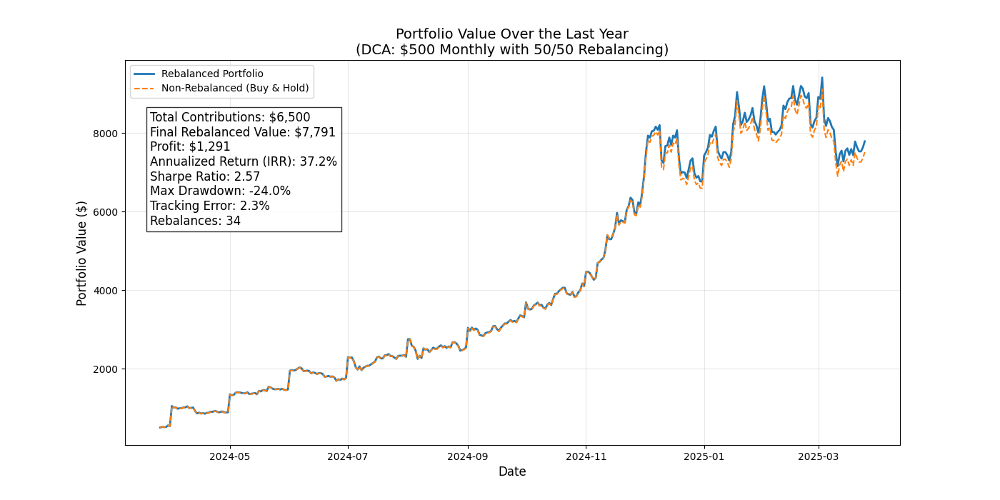

# Dollar-Cost Averaging with Rebalancing Strategy for Cryptocurrencies

This document outlines a strategy that combines Dollar-Cost Averaging (DCA) with periodic rebalancing to invest in cryptocurrencies—specifically Bitcoin and Litecoin. The approach also compares a rebalanced portfolio with a non‐rebalanced (buy‐and‐hold) benchmark and computes several performance metrics, including annualized return (IRR), Sharpe ratio, max drawdown, and tracking error.

---

## Table of Contents

- [Introduction](#introduction)
- [Data Source](#data-source)
- [Strategy Overview](#strategy-overview)
  - [Monthly Contributions (DCA)](#monthly-contributions-dca)
  - [Rebalancing](#rebalancing)
  - [Benchmark: Non-Rebalanced Portfolio](#benchmark-non-rebalanced-portfolio)
- [Methodology](#methodology)
  - [Data Acquisition and Preparation](#data-acquisition-and-preparation)
  - [Simulation Loop](#simulation-loop)
  - [Rebalancing Logic](#rebalancing-logic)
- [Performance Metrics](#performance-metrics)
  - [Annualized Return (IRR)](#annualized-return-irr)
  - [Sharpe Ratio](#sharpe-ratio)
  - [Maximum Drawdown](#maximum-drawdown)
  - [Tracking Error](#tracking-error)
- [Implementation](#implementation)
- [Results & Discussion](#results--discussion)
- [Conclusion](#conclusion)
- [References](#references)

---

## Introduction

The strategy aims to reduce the impact of market volatility by investing a fixed amount of money each month (Dollar-Cost Averaging) and then maintaining a balanced allocation between two assets (Bitcoin and Litecoin) via rebalancing. This ensures that the portfolio remains aligned with the target allocation despite price fluctuations.

---

## Data Source

The historical price data is fetched from the **CoinGecko API**. Due to the limitations of the free tier, only data for the past 365 days is used. The API returns daily prices, which are then used for the simulation.

---

## Strategy Overview

### Monthly Contributions (DCA)

- **Investment Amount:** \$500 per month  
- **Allocation:** \$250 to Bitcoin and \$250 to Litecoin

Each month, on the first available trading day, a fixed amount is invested into each asset. This approach helps to mitigate the impact of volatility over time.

### Rebalancing

- **Target Allocation:** 50% Bitcoin, 50% Litecoin  
- **Rebalance Threshold:** 2% deviation

If the allocation drifts beyond a 2% threshold from the target, the portfolio is rebalanced to restore the 50/50 split. This helps maintain diversification and risk control.

### Benchmark: Non-Rebalanced Portfolio

A parallel simulation of a buy-and-hold (non-rebalanced) portfolio is implemented for comparison. Both portfolios receive identical monthly contributions, but only the rebalanced portfolio adjusts allocations periodically.

---

## Methodology

### Data Acquisition and Preparation

1. **Fetching Data:**  
   Use the CoinGecko API to retrieve daily price data for Bitcoin and Litecoin (past 365 days).

2. **Data Merging:**  
   Convert timestamps to datetime objects and merge the datasets by date into a single DataFrame.

### Simulation Loop

1. **Identify Investment Dates:**  
   The first available trading day of each month is used to simulate the \$500 contribution (\$250 in BTC, \$250 in LTC).

2. **Daily Portfolio Valuation:**  
   For each day:
   - Add monthly contributions on investment dates.
   - Update the total portfolio value based on current holdings and prices.

### Rebalancing Logic

- **Threshold Check:**  
  If the BTC allocation drifts more than 2% away from 50%, rebalance back to a 50/50 allocation.
- **Record Rebalance Dates:**  
  Each time a rebalance occurs, the date is logged for performance reporting.

---

## Performance Metrics

### Annualized Return (IRR)

The annualized return is computed using the Internal Rate of Return (IRR) based on the daily cash flows.  

### Sharpe Ratio

Calculated using daily returns of the rebalanced portfolio, assuming a 0% risk-free rate.  

### Maximum Drawdown

The largest percentage drop from a historical peak in the portfolio value, reflecting downside risk.

### Tracking Error

Annualized standard deviation of the difference between the rebalanced portfolio’s daily returns and the non-rebalanced portfolio’s daily returns.  

---

## Implementation

This strategy is implemented in Python with libraries such as:
- **pandas** for data manipulation
- **matplotlib** for plotting
- **numpy** for numerical calculations
- **numpy_financial** for IRR
- **requests_cache** for caching API responses

The code:
1. Fetches daily crypto prices from CoinGecko.
2. Simulates monthly DCA contributions in both a rebalanced and non-rebalanced portfolio.
3. Computes the performance metrics (annualized return, Sharpe ratio, max drawdown, and tracking error).
4. Plots the portfolio values over time and annotates the chart with key results.

---

## Results & Discussion

Below is a sample of the results obtained from running this strategy over the past year with \$500 monthly contributions and a 50/50 BTC/LTC allocation, rebalanced when allocations deviate by more than 2%:

- **Total Contributions:** \$6,500  
- **Final Rebalanced Value:** \$7,791  
- **Profit:** \$1,291  
- **Annualized Return (IRR):** 37.2%  
- **Sharpe Ratio:** 2.57  
- **Max Drawdown:** -24.0%  
- **Tracking Error:** 2.3%  
- **Rebalances:** 34  

_**Figure:** Portfolio Value Over the Last Year (DCA: \$500 Monthly with 50/50 Rebalancing vs. Buy & Hold)_

### Observations

- **Rebalanced vs. Non-Rebalanced:**  
  The rebalanced portfolio maintains the target allocation, potentially reducing risk and volatility. The buy-and-hold strategy can drift away from 50/50, which may increase or decrease risk depending on market trends.
- **High IRR:**  
  The annualized IRR of ~37% indicates robust growth over this one-year window, although past performance does not guarantee future results.
- **Moderate Sharpe Ratio:**  
  A Sharpe ratio of 2.57 is considered relatively strong, suggesting the portfolio generated good returns for its level of volatility.
- **Drawdown & Tracking Error:**  
  - The max drawdown of -24.0% highlights that cryptocurrencies remain volatile.  
  - The tracking error of 2.3% indicates that the rebalanced portfolio’s daily returns deviate modestly from the buy-and-hold benchmark.

---

## Conclusion

By combining Dollar-Cost Averaging and periodic rebalancing, this strategy aims to mitigate some of the volatility inherent in cryptocurrency markets while maintaining a target allocation. The results show a solid annualized return, moderate drawdowns, and a Sharpe ratio indicative of favorable risk-adjusted returns over this one-year period. However, it is important to note that cryptocurrency markets can be extremely volatile, and past performance does not guarantee future outcomes.

---

## References

- [CoinGecko API Documentation](https://www.coingecko.com/en/api)
- [numpy_financial Documentation](https://pypi.org/project/numpy-financial/)
- [Dollar-Cost Averaging Overview](https://www.investopedia.com/terms/d/dollarcostaveraging.asp)
- [Portfolio Rebalancing](https://www.investopedia.com/terms/r/rebalancing.asp)
- [Sharpe Ratio](https://www.investopedia.com/terms/s/sharperatio.asp)

